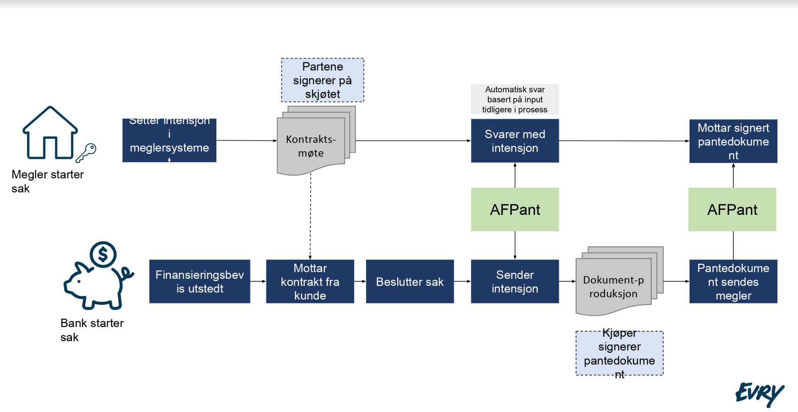

# Intensjon om tinglysingsmetode
## Introduksjon
Tinglysing av hjemmelsovergang og kjøpers pantedokument kan utføres enten elektronisk eller på papir.

Denne meldingstypen skal brukes for å koordinere valgt metode mellom kjøpers bank og megler.

Signering av skjøtet og signering av pantedokumentet skjer på ulike tidspunkt i flyten, noe som kan skape utfordringer ved ulik intensjon mellom bank/megler.

## Forutsetninger
* Hver part sender sin intensjon
* Megler tar stilling til sin intensjon i eget fagsystem
* Bank sender sin spesifikke intensjon og får meglers intensjon i retur.
* Dette betyr at bank ikke vet meglers intensjon før bank sender forespørsel om intensjon

*NB!* I startfasen skal megler alltid ha (signerte) papirdokumenter tilgjengelig selv om intensjon er elektronisk tinglysing.

## Flytskisse: Elektronisk tinglysing

## Implementasjonsdetaljer
Se [her for tekniske detaljer](intensjon-0-1-0.md)