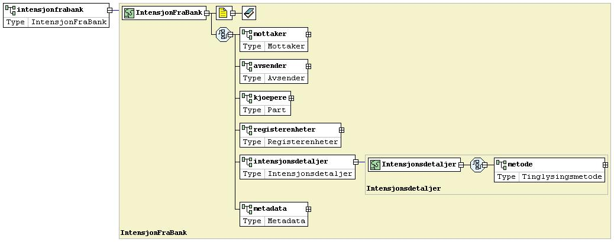
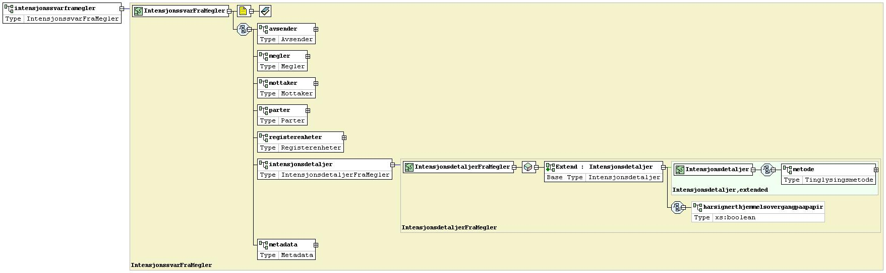
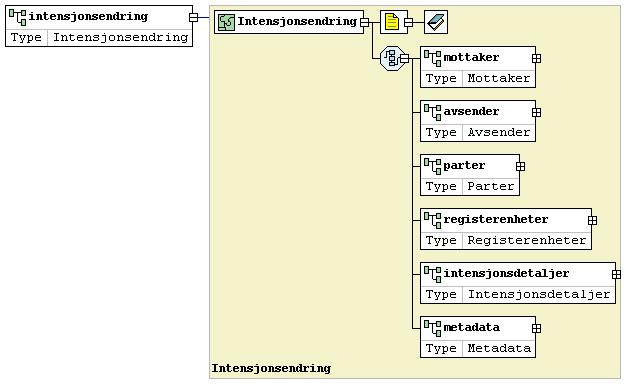

# Ønsket tinglysingsmetode 
En bank kan sende melding om ønsket tinglysingsmetode til en megler (_IntensjonFraBank_) for å avdekke meglers ønskede tinglysingsmetode. Meldingen må inneholde kjøpers fødsels- og personnummer og eiendomsobjektet som skal finansieres. Banken inkluderer sin egen intensjon om tinglysingsmetode i meldingen. 

Megler vil besvare med en melding (_IntensjonssvarFraMegler_) som inneholder strukturerte data om eiendommen og partene, gjeldende intensjon om tinglysingmetode samt informasjon om hvorvidt signert skjøte/hjemmelsovergang på papir er registrert i meglers depot (papir er reserveløsning).

Dersom meldingen ikke kan besvares, vil banken få en NACK-response i retur hvor status beskriver hvorfor megler ikke kan besvare forespørselen.

*NB!* Bank må håndtere NACK-response på melding (_IntensjonFraBank_) hvor status er "**UavklartTinglysingsmetode**" (megler har ikke tatt stilling til metode for tinglysing).
Mottaker må implementere tilstrekkelig varsling/håndtering av denne situasjonen. 

I et scenario hvor boligkjøper har innhentet tilbud fra flere banker vil megler måtte forvente å motta melding om intensjon fra flere banker. 

## Endring av tinglysingsmetode
Dersom en endring av tinglysingmetode oppstår må det kringkastes en oppdatering fra den som endrer sin intensjon (_Intensjonsendring_). Intensjonsendring-meldingen er en push-melding og har ingen tilhørende "svar"-melding. 
Eksempel: 
- det blir realkausjon, tinglysingmetode papir (bank pusher til megler) 
- noen av partene blir forhindret fra å benytte BankId-signering, tinglysingsmetode papir (megler pusher til bank(er))

## Implementasjonskrav
Alle som implementerer støtte for mottak av "_IntensjonFraBank_" eller mottak av "_IntensjonssvarFraMegler_" må også støtte mottak og sending av "_Intensjonsendring_".

Mottakere av meldingstypen "_IntensjonFraBank_" må benytte avsenders saksnummer (_IntensjonFraBank.Avsender.Referanse_) i all videre kommunikasjon til avsenderbank.

## Validering og ruting
### Ruting (meglersystem)
- mottakende systemleverandør søker blant alle sine kunders matrikkelenhet(er)
- utvalget avgrenses til matrikkelenheter som tilhører meglersaker hvor organisasjonsnummeret til meglerforetaket på meglersaken er lik organisasjonsnummeret til **mottaker i forespørselen**, _IntensjonFraBank.Mottaker.Id_.
- utvalget avgrenses til meglersaker hvor **minst 1 kjøper i forespørselen er registrert som kjøper på meglersaken** 
- matrikkelenhetens eiendomsnivå må være korrekt angitt (viktig i tilfelle festet eiendom). Eksempel: En forsendelse med angitt eiendomsnivå "Eiendomsrett" må avvises (NACK) av mottaker dersom det i meglersystemet er snakk om omsetning av (frem)festerett.
 
### Ruting (banksystem)
- mottakende systemleverandør søker blant lånesaker hvor saksnummer matcher _IntensjonssvarFraMegler.Mottaker.Referanse_/_Intensjonsendring.Mottaker.Referanse_ og **minst 1 kjøper i forespørselen er registrert som debitor i lånesaken** 

## Meldingstype: IntensjonFraBank
Benyttes av bank for å informere megler om bankens planlagte tinglysingmetode og for å motta svar fra megler om gjeldende tinglysingmetode.
Bank *må* alltid oppgi sitt saksnummer i _IntensjonFraBank.Avsender.Referanse_-feltet.

### Manifest
(BrokerServiceInitiation.Manifest.PropertyList)

|Manifest key|Type|Obligatorisk|Beskrivelse|
|--- |--- |--- |--- |
|messageType|String|Ja|IntensjonFraBank|

### Payload
En ZIP-fil som inneholder en XML med requestdata ihht. [definert skjema.](../afpant-model/xsd/dsve-1.0.0.xsd)

#### Om payload *(request)*
- En xml-fil av modell **IntensjonFraBank** som er i henhold til [definert skjema.](../afpant-model/xsd/dsve-1.0.0.xsd)
- [Se eksempel på presentasjon](examples/intensjonfrabank-example.PNG)

##### Modell

## Meldingstype: IntensjonssvarFraMegler
Benyttes som svar fra meglersystem til banksystem etter mottatt "_IntensjonFraBank_".

Avsenders referanse (_IntensjonFraBank.Avsender.Referanse_) skal inkluderes som mottakers referanse i svaret (verdien i _IntensjonFraBank.Avsender.Referanse_ kopieres til _IntensjonssvarFraMegler.Mottaker.Referanse_).

### Manifest
(BrokerServiceInitiation.Manifest.PropertyList)

|Manifest key|Type|Obligatorisk|Beskrivelse|
|--- |--- |--- |--- |
|messageType|String|Ja|IntensjonssvarFraMegler|
|status|String (enum)|Ja|Denne kan være en av følgende statuser:  - RutetSuksessfullt  - UavklartTinglysingsmetode (Megler har ikke tatt stilling til tinglysingsmetode)  - UkjentRegisterenhet (ukjent register/matrikkelenhet)  - UgyldigKjøper (fant matrikkelenhet, men kjøper eller navn/id på kjøper matcher ikke registrerte data hos mottaker)  - Avvist (sendt til et organisasjonsnummer som ikke lenger har et aktivt kundeforhold hos leverandøren - feil config i Altinn AFPANT, eller ugyldig forsendelse).  Kun status '**RutetSuksessfullt**' er å anse som ACK (positive acknowledgement) hvor . Øvrige statuser er å anse som NACK (negative acknowledgement).|
|statusDescription|String|Ja|Inneholder en utfyllende human-readable beskrivelse om hvorfor en forsendelse ble NACK'et.|

### Payload
En ZIP-fil som inneholder en XML med requestdata ihht. [definert skjema.](../afpant-model/xsd/dsve-1.0.0.xsd)
		
#### Om payload *(response)*

##### Positiv resultat (ACK)
- En xml-fil av modell **IntensjonssvarFraMegler** som er i henhold til [definert skjema](../afpant-model/xsd/dsve-1.0.0.xsd).
- Se eksempel på presentasjon: [Eksempel](examples/intensjonssvarframegler-example.png)

##### Modell

##### Negativt resultat (NACK)
- Tom payload returneres (ZIP arkiv med dummy innhold). Manifest key "status" og "statusDescription" må avleses for årsak. 

## Meldingstype: Intensjonsendring
Benyttes for å kringkaste en endring i tinglysingsmetode for et gitt oppdrag/oppgjør. Denne meldingstypen har ingen tilsvarende "Svar"-melding (og som en følge av dette ingen ACK/NACK fra mottaker).
- Bank som har sendt "_IntensjonFraBank_" til megler må sende "_Intensjonsendring_" til samme megler ved endringer
- Megler må sende "_Intensjonsendring_" til _alle_ banker som har mottatt "_IntensjonssvarFraMegler_" ved endringer 
- Bank har i utgangspunktet ingen muligheter for å rute meldingen basert kun på registerenhet og partene (kjøperne). Bankens saksnummer (hentes fra _IntensjonFraBank.Avsender.Referanse_) *må* angis i _Intensjonsendring.Mottaker.Referanse_-feltet.

### Manifest
(BrokerServiceInitiation.Manifest.PropertyList)

|Manifest key|Type|Obligatorisk|Beskrivelse|
|--- |--- |--- |--- |
|messageType|String|Ja|Intensjonsendring|

### Payload
En ZIP-fil som inneholder en XML med requestdata ihht. [definert skjema.](../afpant-model/xsd/dsve-1.0.0.xsd)

#### Om payload *(request)*
- En xml-fil av modell **Intensjonsendring** som er i henhold til [definert skjema.](../afpant-model/xsd/dsve-1.0.0.xsd)
- [Se eksempel på presentasjon - megler er avsender](examples/intensjonsendring-fra-megler-example.PNG)
- [Se eksempel på presentasjon - bank er avsender](examples/intensjonsendring-fra-bank-example.PNG)
 
##### Modell

