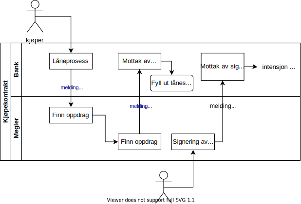
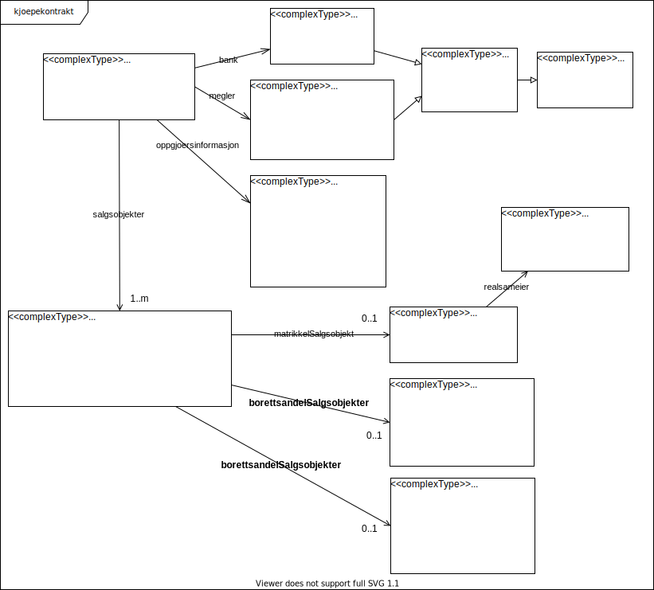

Kjøpekontrakt - teknisk-beskrivelse
==========================================

Beskrivelse av teknisk løsning for meldinger som gjør at megler kan dele strukturerte data i kjøpekontrakten med bank.

Hovedflyten består i at bank [forespør megler](#meldingstype-kjoepekontraktforespoerselfrabank) etter kjøpekontrakt, og megler [svarer med kjøpekontrakten](#meldingstype-kjoepekontraktsvarframegler). 
Ved signifikante endringer skal megler [sende kjøpekontrakten](#meldingstype-kjoepekontraktframegler) igjen.
Hvilke endringer/felter som krever at megler sender på nytt er angitt med _hake_ i tabellen i [løsningsbeskrivelsen](kjoepekontrakt-loesningsbeskrivelse.md#svar-fra-megler) 

# Implementasjonskrav

Alle banker som implementerer støtte for mottak av [KjoepekontraktSvarFraMegler](#meldingstype-kjoepekontraktsvarframegler) 
må også støtte mottak av [KjoepekontraktFraMegler](#meldingstype-kjoepekontraktframegler).

# Meldingstyper
## Oversikt over meldingstyper for kjøpekontrakt
| Navn | Beskrivelse | Payload/vedlagt fil | 
|------|------|----|
| [KjoepekontraktforespoerselFraBank](#meldingstype-kjoepekontraktforespoerselfrabank) | Bank forespør kjøpekontrakt fra megler | XSD: KjoepekontraktforespoerselFraBank | 
| [KjoepekontraktSvarFraMegler](#meldingstype-kjoepekontraktsvarframegler)  | Meglers svar på Kjøpekontraktforespørsel fra bank | XSD: KjoepekontraktSvarFraMegler |
| [KjoepekontraktFraMegler](#meldingstype-kjoepekontraktframegler) | Megler sender uoppfordret til bank eller ved viktige endringer. Denne meldingen skal ikke besvares | XSD: KjoepekontraktFraMegler |  

# Meldingstype: KjoepekontraktforespoerselFraBank
Bank forespør kjøpekontrakt fra megler

## Validering og ruting (banksystem)
Bank forespør kjøpekontrakt fra megler.

Skal innehold megler(`kjoepekontraktforespoerselfrabank.megler`), bank(`kjoepekontraktforespoerselfrabank.bank`) 
og minst en av kjøperene(`kjoepekontraktforespoerselfrabank.kjoepere`).

[Se XML-eksempel:](./examples/kjoepekontraktforespoerselFraBank-example.xml)

## Payload
ZIP-arkiv som skal inneholde en XML fil med requestdata ihht. [definert skjema.](../afpant-model/xsd/dsve-1.0.0.xsd)

**Krav til filnavn i ZIP-arkiv:** Filnavnet til meldingen KjoepekontraktFraMegler må følge konvensjonen: _kjoepekontraktforespoerselfrabank*.xml_ . (navnet til meldingen i lowercase)

Wildcard "*" kan erstattes med en vilkårlig streng (må være et gyldig filnavn), f.eks lånesaksnummer eller annen relevant referanse for avsender. 

## Manifest
(BrokerServiceInitiation.Manifest.PropertyList)

|Manifest key|Type|Required|Beskrivelse|
|--- |--- |--- |--- |
|messageType|String|Yes|KjoepekontraktforespoerselFraBank|

# Meldingstype: KjoepekontraktSvarFraMegler
Meglers svar på [KjoepekontraktforespoerselFraBank](#meldingstype-kjoepekontraktforespoerselfrabank) fra banken. 

*Kjøperkontrakt fra aktive[1](#f1) oppdrag som har minst en kjøper fra forespøreselen skal returneres.*

Megler må ta var på `kjoepekontraktforespoerselfrabank.bank.referanse` på saken. Skal brukes til å sette `kjoepekontrakt.bank.referanse` 
ved sending av svaret og evt. senere endringer, [KjoepekontraktFraMegler](#meldingstype-kjoepekontraktframegler) 

Dersom kjøpekontrakten er signert skal vedlegget med korrekt filnavn være definert som en ressurs/vedlegg i meldingens metadata 
OG eksistere i ZIP-arkivet.

## Validering og ruting (meglersystem)
Håndtering av meldingstype [KjoepekontraktforespoerselFraBank](#meldingstype-kjoepekontraktforespoerselfrabank):
- Systemleverandør/meglersystem søker blant alle sine kunders oppdrag/oppgjør etter kjøpekontrakt.
- OG utvalget av kjøpekontrakter avgrenses til:
  - meglersaker hvor organisasjonsnummeret til meglerforetaket på meglersaken er lik organisasjonsnummeret megler(`kjoepekontraktforespoerselfrabank.megler`)
  - OG meglersaker hvor **minst 1 kjøper i forespørselen er registrert som kjøper på meglersaken**
  - OG meglersaker som ikke er slettet/arkivert eller eldre enn ?

[Se XML-eksempel](./examples/kjoepekontraktsvarFraMegler-example.xml)

## Payload

Dersom status i manifestet er _RutetSuksessfullt_ (se beskrivelse av manifest under) skal ZIP-arkivet inneholde en XML xml-fil 
med `KjoepekontraktSvarFraMegler` som root element definert av [definert skjema.](../afpant-model/xsd/dsve-1.0.0.xsd)
Dersom kjøpekontrakten er signert skal ZIP-arkiv også innholde den signert kjøpekontrakten være med som en egen fil.
Den signert kjøpekontrakten er enten en PDF eller en SDO.

**Krav til filnavn i ZIP-arkiv:** 
* Filnavnet til meldingen KjoepekontraktSvarFraMegler må følge konvensjonen: _kjoepekontraktsvarframegler*.xml_ . (navnet til meldingen i lowercase)
* Filnavnet til en evt. signert kjøpekontrakt skal følge konvensjonen: _signert_kjoepekontrakt*.(pdf|sdo)_.

## Manifest
(BrokerServiceInitiation.Manifest.PropertyList)

|Manifest key|Type|Obligatorisk|Beskrivelse|
|--- |--- |--- |--- |
|messageType|String|Ja|KjoepekontraktsvarFraMegler|
|status|String (enum)|Ja|Denne kan være en av følgende statuser: <ol><li>**RutetSuksessfullt** Status 'RutetSuksessfullt' er å anse som ACK (positive acknowledgement) hvor . Øvrige statuser er å anse som NACK (negative acknowledgement).</li><li>**UgyldigKjøper** Megler har ikke funnet oppgjør/oppdrag for angitt(e) kjøper(e)</li> <li>**Avvist** (sendt til et organisasjonsnummer som ikke lenger har et aktivt kundeforhold hos leverandøren - feil config i Altinn AFPANT, eller ugyldig forsendelse).</li></ol>Kun status '**RutetSuksessfullt**' er å anse som ACK (positive acknowledgement) hvor . Øvrige statuser er å anse som NACK (negative acknowledgement).|
|statusDescription|String|Nei|Inneholder en utfyllende, menneskelig-lesbar beskrivelse om hvorfor en forsendelse ble NACK-et.|

## Payload
En ZIP-fil som inneholder en XML med requestdata ihht. [definert skjema.](../afpant-model/xsd/dsve-1.0.0.xsd)

### Positiv resultat (ACK)
- En xml-fil med **kjoepekontraktsvarFraMegler** som root element og som er i henhold til [definert skjema](../afpant-model/xsd/dsve-1.0.0.xsd).

Merk at signert kjøpekontrakt skal finnes som en egen fil i ZIP-arkivet dersom metdata inneholder et vedlegg som matcher _signert_kjoepekontrakt*.(pdf|sdo)_.

### Negativt resultat (NACK)
- Tom payload returneres (ZIP arkiv med dummy innhold). Manifest key "status" og "statusDescription" må avleses for årsak.

# Meldingstype: KjoepekontraktFraMegler
Megler sender uoppfordret til bank eller ved ved signifikante endringer.

* **Sendes uoppfordret** (bank har ikke forespurt kjøpekontrakt)  
  Denne meldingen kan kun sendes uoppfordret fra megler til bank dersom kjøpekontrakten er signert. 
Den signert kjøpekontrakten skal da finnes i ZIP-arkivet som _signert_kjoepekontrakt*.(pdf|sdo)_ 
OG metdata skal inneholde en ressurs/vedlegg med korrekt navn.
* **Ved endring** (bank har tidligere forespurt kjøpekontrakt eller mottatt signert kjøpekontrakt uoppfordret)  
  Sendes ved endring, dvs. at megler har tidligere sendt uoppfordret eller har mottatt en forespørsel.
Felter som krever at det sendes en `KjoepekontraktFraMegler` melding til bank er marker med _hake_ i tabell i _hake_ i tabellen i [løsningsbeskrivelsen](kjoepekontrakt-loesningsbeskrivelse.md#svar-fra-megler)

Dersom kjøpekontrakten er signert skal vedlegget med korrekt filnavn være definert som en ressurs/vedlegg i meldingens metadata OG eksistere i ZIP-arkivet.

_Denne meldingen skal ikke besvares._ 

## Validering og ruting(banksystem)
Mottakende systemleverandør søker blant lånesaker hvor saksnummer matcher `kjoepekontrakt.bank.referanse` dersom den er angitt.

Dersom dette er en uoppfordret melding med signert kjøpekontrakt, trenger ikke `kjoepekontrakt.bank.referanse` være utfylt.
I disse tilfellene må bank:
* søke blant lånsesaker avgrenset til:
  * eiendommer/borettsandeler angitt i kjøpekontrakten
  * OG minst 1 kjøper angitt i kjøpekontrakten
  
## Validering og ruting(meglersystem)
Megler må sette `kjoepekontrakt.bank.referanse` dersom megler tidligere har mottatt [KjoepekontraktforespoerselFraBank](#meldingstype-kjoepekontraktforespoerselfrabank) 

## Payload
At ZIP-arkiv som inneholder en xml-fil med **KjoepekontraktFraMegler** som root element og som er i henhold til [definert skjema](../afpant-model/xsd/dsve-1.0.0.xsd).
Dersom kjøpekontrakten er signert skal ZIP-arkiv også innholde den signert kjøpekontrakten være med som en egen fil.
Den signert kjøpekontrakten er enten en PDF eller en SDO.

**Krav til filnavn i ZIP-arkiv:**
* Filnavnet til meldingen kjoepekontraktFraMegler må følge konvensjonen: _kjoepekontraktframegler*.xml_ . (navnet til meldingen i lowercase)
* Filnavnet til en evt. signert kjøpekontrakt skal følge konvensjonen: _signert_kjoepekontrakt*.(pdf|sdo)_.

## Manifest
(BrokerServiceInitiation.Manifest.PropertyList)

|Manifest key|Type|Required|Beskrivelse|
|--- |--- |--- |--- |
|messageType|String|Yes|KjoepekontraktFraMegler|

# Fotnoter
<b id="f1">1</b> Aktive oppdrag [↩](#ref_f1)
* Når "arkiveres" eller ferdigstilles et oppdrag? Dette er opp til megler/meglersystem.
* Hensyn til GDPR. Hvor lange er det hensiktsmessig/lovlig å lagre data.
