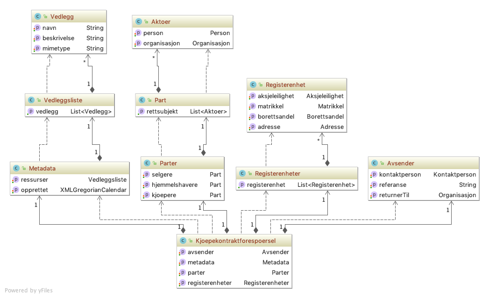
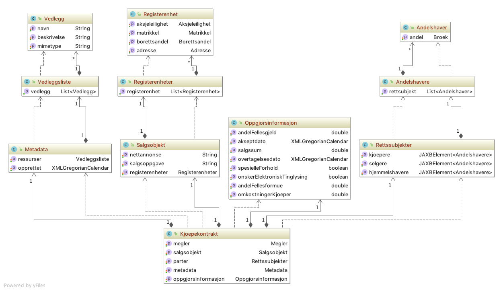
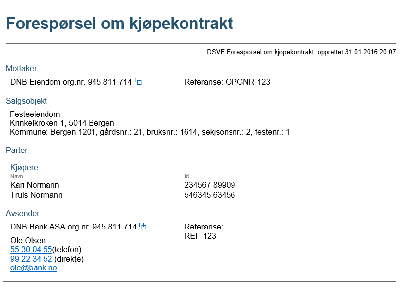

# Kjøpekontrakt

En bank kan sende forespørsel om kjøpekontrakt til en megler basert på kjøpers fødsels og personnummer og eiendomsobjektet som skal finansieres.
Megler vil besvare forespørselen med en forsendelse som inneholder stukrutrerte data samt en signert versjon av den fulle kontrakten.
Dersom den faktiske kjøpekontrakten ikke er signert, skal kun den strukturerte delen returneres.
Dersom forespørselen ikke kan besvares, vil banken få en feilmelding i retur som beskriver hvorfor megler ikke kan besvare forespørselen.

## Forspørsel om kjøpekontrakt
Forespørsel sendes fra bank til megler for å hente kjøpekontrakten for en kunde.
Det forventes at positivt svar er en kjøpekontrakt som definert under.

### Manifest
(BrokerServiceInitiation.Manifest.PropertyList)

|Manifest key|Type|Required|Beskrivelse|
|--- |--- |--- |--- |
|messageType|String|Yes|RealEstatePurchaseContractRequest|

### Payload
En ZIP-fil som inneholder en XML med requestdata ihht. [definert skjema.](../afpant-model/xsd/dsbm-1.0.0.xsd)

#### Om payload *(request)*
- En xml-fil som er i henhold til xsd-filen.
- Se eksempel på presentasjon [Eksempel](examples/kjoepekontrakt-request-example-xml.png)

##### Model

## Kjøpekontrakt
Svar fra meglersystem til banksystem.

### Manifest
(BrokerServiceInitiation.Manifest.PropertyList)

|Manifest key|Type|Required|Beskrivelse|
|--- |--- |--- |--- |
|messageType|String|Yes|RealEstatePurchaseContract|

### Payload
En ZIP-fil som inneholder en XML med responsdata ihht. gitte xsd.
Tilknytting av ZIP-fil til forsendelsen kan gjøres ved bruk av BrokerServiceExternalBasicStreamedClient / StreamedPayloadBasicBE.
		
#### Om payload *(response)*

##### Positiv resultat
- Må være en xml-fil som er ihht. [definert skjema](../afpant-model/xsd/dsbm-1.0.0.xsd).
- Se eksempel på presentasjon [Eksempel](examples/kjoepekontrakt-example-xml.png)

##### Model

##### Negativt resultat
- @todo:Må definere hvor ack/navk-informasjon skal legges

## Eksempel

### Forespørsel

### Svar
