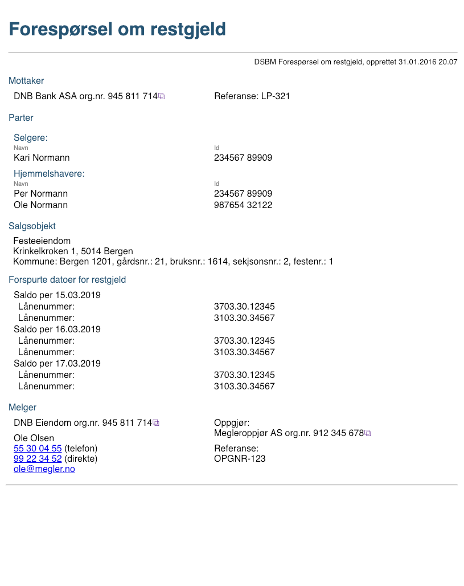
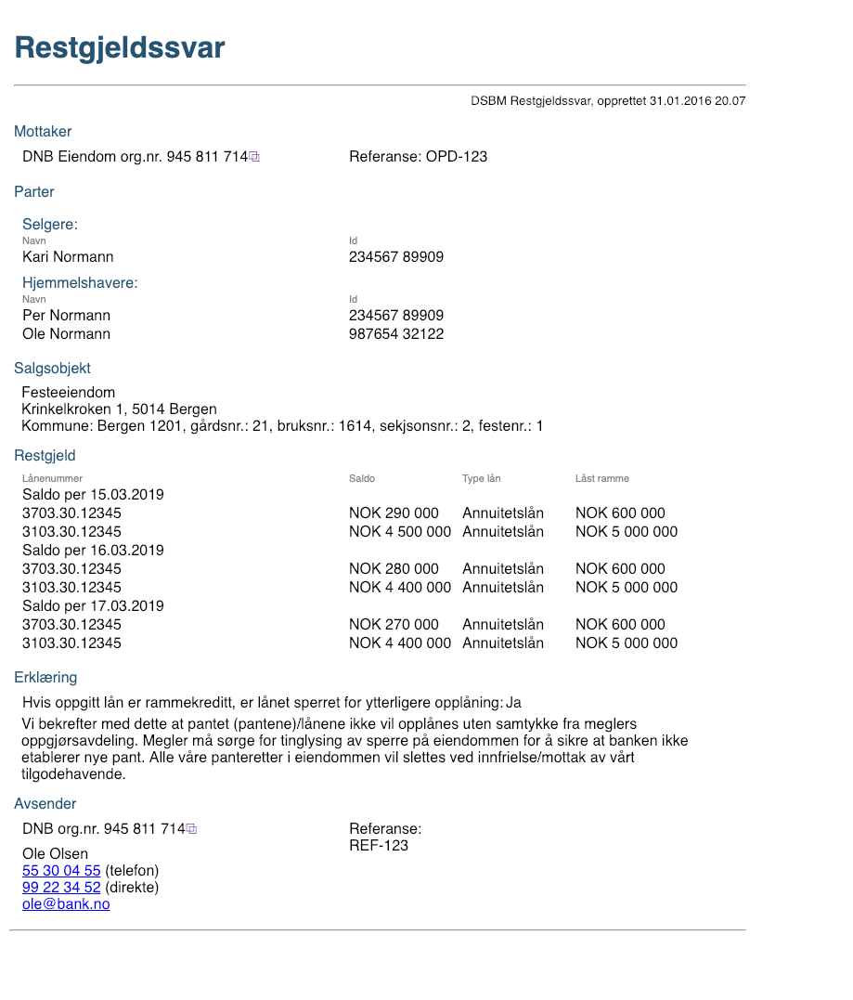

# Restgjeld

## Forspørsel om restgjeld
Forespørsel sendes fra megler til bank for å hente restgjeld for innfielse av låv ifm. oppgjøret.
Det forventes at positivt svar levers som definert under.

### Manifest
(BrokerServiceInitiation.Manifest.PropertyList)

|Manifest key|Type|Required|Beskrivelse|
|--- |--- |--- |--- |
|messageType|String|Yes|FutureRemainingDebtRequest|

### Payload
En ZIP-fil som inneholder en XML med requestdata ihht. [definert skjema.](../afpant-model/xsd/dsbm-1.0.0.xsd)

#### Om payload *(request)*
- En xml-fil som er i henhold til xsd-filen.
- Se eksempel på presentasjon [Eksempel](examples/restgjeldsforespoersel-example-xml.png)

##### Model

## Restgjeldssvar
Svar fra bank til megler.

### Manifest
(BrokerServiceInitiation.Manifest.PropertyList)

|Manifest key|Type|Required|Beskrivelse|
|--- |--- |--- |--- |
|messageType|String|Yes|FutureRemainingDebt|

### Payload
En ZIP-fil som inneholder en XML med responsdata ihht. gitte xsd.
Tilknytting av ZIP-fil til forsendelsen kan gjøres ved bruk av BrokerServiceExternalBasicStreamedClient / StreamedPayloadBasicBE.
		
#### Om payload *(response)*

##### Positiv resultat
- Må være en xml-fil som er ihht. [definert skjema](../afpant-model/xsd/dsbm-1.0.0.xsd).
- Se eksempel på presentasjon [Eksempel](examples/restgjeldssvar-example-xml.png)

##### Model

##### Negativt resultat
- @todo:Må definere hvor ack/navk-informasjon skal legges

## Eksempel

### Forespørsel

### Svar
