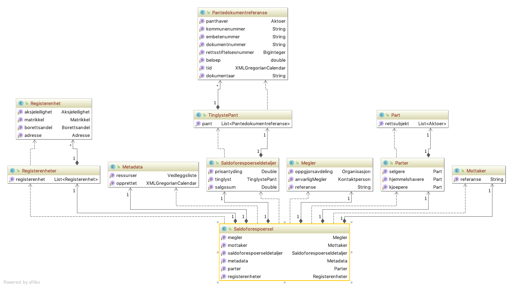
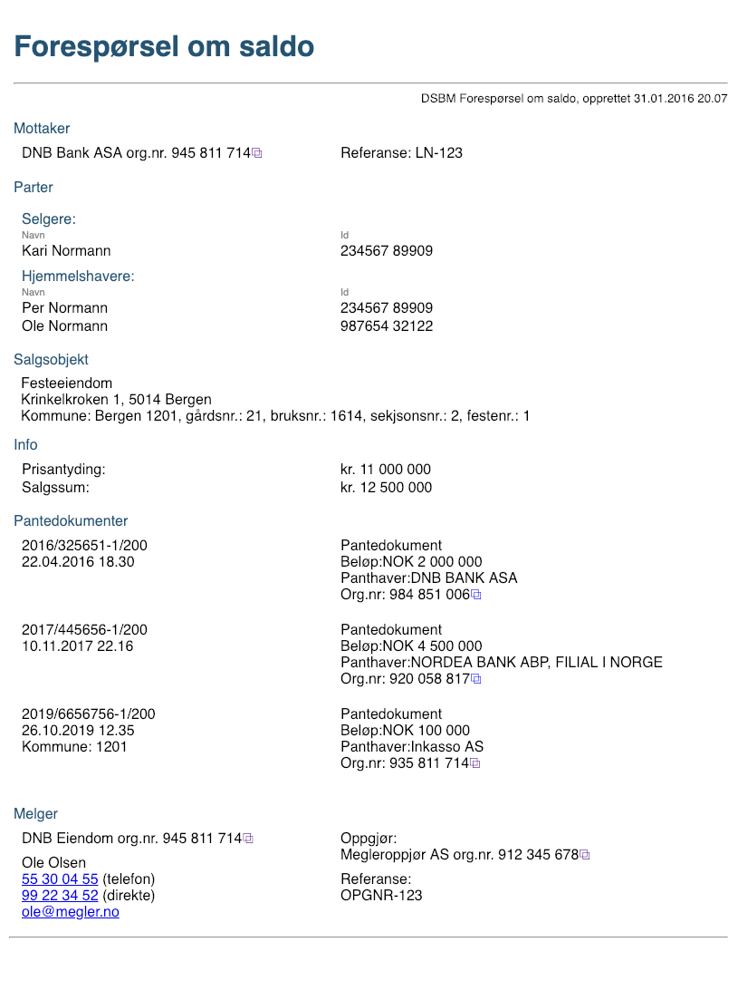
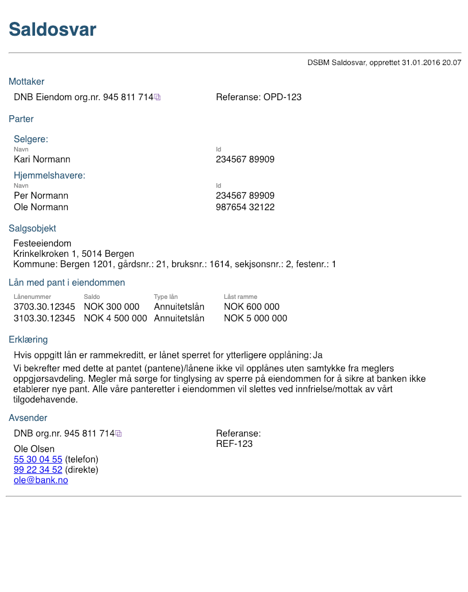

# Saldo

## Forspørsel om saldo
Forespørsel sendes fra megler til bank for å finne saldo.
Det forventes at positivt svar er som definert under.

### Manifest
(BrokerServiceInitiation.Manifest.PropertyList)

|Manifest key|Type|Required|Beskrivelse|
|--- |--- |--- |--- |
|messageType|String|Yes|RemainingDebtRequest|

### Payload
En ZIP-fil som inneholder en XML med requestdata ihht. [definert skjema.](./../../../afpant-model/xsd/dsve.xsd)

#### Om payload *(request)*
- En xml-fil som er i henhold til xsd-filen.
- Se eksempel på presentasjon [Eksempel](examples/saldoforespoersel-request-example-xml.png)

#### Model

## Saldosvar
Svar fra bank til megler.

### Manifest
(BrokerServiceInitiation.Manifest.PropertyList)

|Manifest key|Type|Required|Beskrivelse|
|--- |--- |--- |--- |
|messageType|String|Yes|RemainingDebt|

### Payload
En ZIP-fil som inneholder en XML med responsdata ihht. gitte xsd.
Tilknytting av ZIP-fil til forsendelsen kan gjøres ved bruk av BrokerServiceExternalBasicStreamedClient / StreamedPayloadBasicBE.
		
#### Om payload *(response)*

##### Positiv resultat
- Må være en xml-fil som er ihht. [definert skjema](./../../../afpant-model/xsd/dsve.xsd).
- Se eksempel på presentasjon [Eksempel](examples/saldoforespoersel-response-example-xml.png)

##### Model

##### Negativt resultat
- @todo:Må definere hvor ack/navk-informasjon skal legges

## Eksempel

### Forespørsel

### Svar

